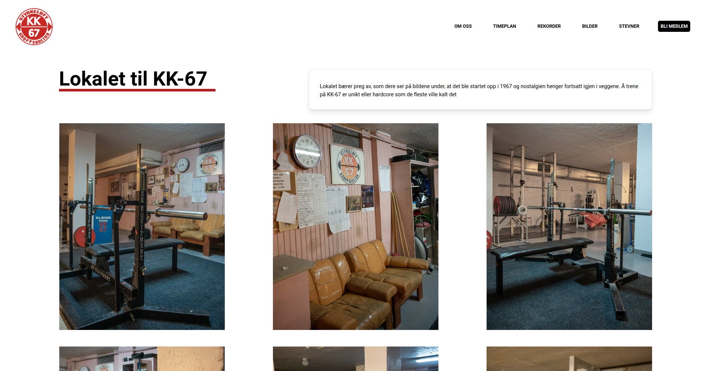

# KK67 - Website

This is the source code for the KK-67 website (currently in development).

<br >


## Website Concept:

A concept draft has been created and approved (thus far) by KK67 leader, **Jostein Fiveltun**.

Our aim is to develop a website that matches the concept draft provided [**here**](./assets/)




<br >

# Get started

## Recommended IDE Setup

- [VSCode](https://code.visualstudio.com/) + [Volar](https://marketplace.visualstudio.com/items?itemName=johnsoncodehk.volar)

## Contribute

This website is maintained by [**Marius Arhaug**](https://www.github.com/MariusArhaug).

To contribute to this project, follow the guidelines described in the [CONTRIBUTING.md](./CONTRIBUTING.md)

## Available Scripts

In the project directory, you can run:

```sh
$ yarn install
```

Installs the nessesary dependencies defined in [package.json](package.json)

```sh
$ yarn dev
```

Runs the app in the development mode.\
Open [**http://localhost:3000**](http://localhost:3000) to view it in the browser.

The page will reload if you make edits.\
You will also see any lint errors in the console.

```sh
$ yarn dev:host
```

Runs the app in development mode and also hosts the localhost to your local network. Allowing you to view the website from other computers or even phones! The terminal will provide ip addresses for you to use.

<br >

```sh
$ yarn build
```

Transpile `TypeScript` into `JavaScript` and check for build errors.

```sh
yarn preview
```

Previews the built package as if it were to be deployed.
